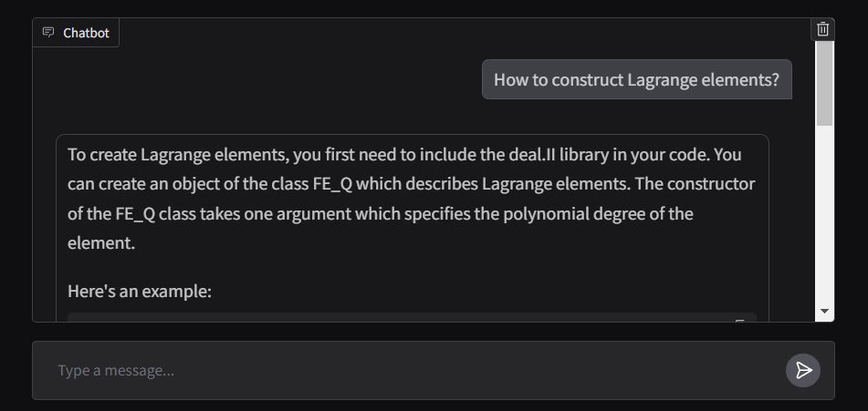

# deal.II Virtual Assistant

## Introduction

One of the most powerful applications of LLMs is the creation of sophisticated question-answering (Q&A) chatbots, capable of providing accurate answers based on specific source information. This project focuses on developing a virtual assistant for the [deal.II](https://www.dealii.org/) library, an open-source C++ finite element library, using a technique known as Retrieval-Augmented Generation (RAG). The dataset is sourced from 90 tutorial steps provided in the official deal.II documentation, accessible [here](https://dealii.org/current/doxygen/deal.II/Tutorial.html), along with a suite of test files available in the deal.II project’s source code repository, accessible [here](https://github.com/dealii/dealii/tree/master/tests). 

The large language model (LLM) engine is provided by [Cohere](https://cohere.com/) which is known for delivering high-quality LLM models for embeddings and chat services. For the vector database, we chose [Chroma](https://www.trychroma.com/) due to its open-source nature, speed, and efficiency in searching and retrieving vectors. The [Langchain](https://www.langchain.com/) framework is used to efficiently manage the interaction between the user's input, the processing of queries, and the retrieval of relevant information from the vector database, ensuring seamless integration between various components of the model.

## Data Preparation

The process for preparing the databases is as follows: First, the tutorial pages are retrieved from the website as Langchain Document objects. To improve access speed (during testing time), these Document objects are saved as JSON files on the local disk. The documents are then split into appropriately sized chunks (around 400 tokens per chunk with an overlap of 40 tokens). In total, this dataset comprises 2.3 million tokens. Next, these split documents are embedded into the vector database. 

A separate database is used for the test suite to prevent dominance by the numerous, generally shorter test files with potentially repetitive code. This separation ensures that both sources are equally represented in retrieval results. Each test file is embedded in the database without splitting, as the files are typically concise. This approach preserves the cohesion of the code, helping the LLM have a complete view of code examples and enabling it to produce accurate, complete responses. The test suite dataset contains a total of 5.8 million tokens.

## Model Architecture

The model is built using four chains and three prompt templates.

1. **Reformulate Chain**: This chain receives the user's question and conversation history, then reformulates the question based on the previous dialogue. For instance, if the first question is "What is FE_Nothing?" and the second question is "Where can I use it?", the reformulation chain will modify the second question to "Where can I use FE_Nothing?" This step essentially adds memory to the conversation, ensuring context continuity.

2. **Multi-Question Chain**: This chain takes the reformulated question and generates four similar questions, providing multiple perspectives. It outputs a Python list of questions using a simple lambda function, and any empty lines are removed using the `remove_empty_string` function as the final step.

3. **Retrieval Chain**: This chain takes the five questions (including the original question) from the previous chain and queries both vector databases. The vector databases search for similar vectors and retrieve relevant documents. Since the same document might be retrieved multiple times for different questions, a unique set of documents is created using the `get_unique_union` function as the last step. Finally, the retrieved documents from both databases are combined into a single list.

4. **RAG Chain**: This chain uses the question, conversation history, and the retrieved documents from the previous chain as the context to generate the final answer.

## Deployment

The front end of the application is built using Gradio's `ChatInterface`, with the response function designed to stream the output in real time.
The application is deployed in the Hugging Face Spaces and can be accessed [here](https://huggingface.co/spaces/mma666/dealii_assistant_test_suite_standard).

## How to Get Better Responses

Cohere offers LLMs with varying levels of capability, including *Command-R* at the intermediate level and *Command-R-Plus* as the highest-performing model. The level of intelligence, reasoning, and analytical ability in an LLM has a significant impact on the quality of its responses. While advanced models come with higher costs, it is currently possible to use the most advanced LLM for free. Note that free APIs are rate-limited, making them unsuitable for multi-user environments. To use the free API, follow these steps:

1. Sign up for an account on the [Cohere](https://cohere.com/) website.
2. In your dashboard, obtain a free trial API key (the default API key in your API list is sufficient).
3. Set up your environment by installing the required packages listed at the top of the *app.ipynb* file.
4. Copy and paste the API key into the `cohere_api` variable in *app.ipynb*.
5. Update the model name from `'command-r'` to `'command-r-plus'` in the following line:  
   `llm = ChatCohere(model='command-r', temperature=0.)`
6. Run all the cells in the notebook.
7. After the `gr.ChatInterface` command, you will see a local URL for the chat interface, which can be used to interact with the model.

Also, if conversation history is unimportant, refreshing the chat webpage frequently can be beneficial, as it allows the model to start with a clear memory.
